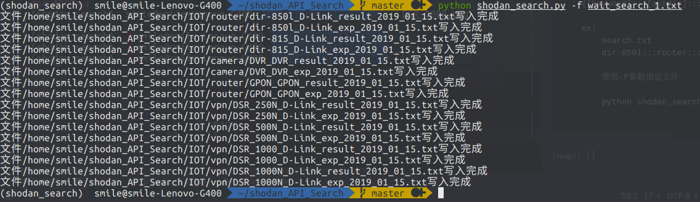

####此脚本基于python3

##使用前安装shodan

> pip install shadon


##使用说明 
需要再`config`文件中配置`API_KEY`

设置结果保存的路径 `LIB_DIR`

```text
python shodan_search.py [-f] [-k] [-l] [--outfile] [--type] [--brand]

Usage: usage:shodan_search.py wait

Options:
  -h, --help            show this help message and exit
  -k KEYWORD, --keyword=KEYWORD
                        Please input you want search keyword
  -l LIMIT, --limit=LIMIT
  -f FILE, --file=FILE  Specified file
  --outdir=OUTDIR       Output type [camera, vpn, router]
  --type=DEVICE_TYPE    device model
  --brand=BRAND         Name of manufacturer
  
-k     要搜索的关键字
-l     要搜索的数据条数
-f     外部导入文件批量搜索
--outdir    指定输出的二级目录
--type      当前搜索关键字的型号[结果文件命名使用]
--brand     当前搜索关键字的厂商名[结果文件命令使用]

example:
	搜索关键字为 "dir-850l"
	python shodan_search.py -k "dir-850l" --outdir "router" --type "d-link_850l" --brand "D_Link"
	
	指定要查询的条数: 搜索关键字为 "dir-850",返回200数据
	python shodan_search.py -k "dir-850l" --outdir "router" --type "d-link_850l" --brand "D_Link" -l 200
	
	
	从文件中读取数据并查询：
	从文件中读取，但是需要使用一定的格式
	{关键字[搜索关键字]}:::{输出地址[用做路径信息]}:::{路由器型号[用做文件名]}:::{厂商[用做文件名]}
    {[keyword]:::[outdir]:::[device_type]:::[brand]}

    ex:
        search.txt
        dir-850l:::router:::dir-850l:::D-Link
        
	使用-f参数指定文件
	
	python shodan_search.py -f "search.txt"

```

image:
从文件导入关键字:


直接输入关键字查询:
